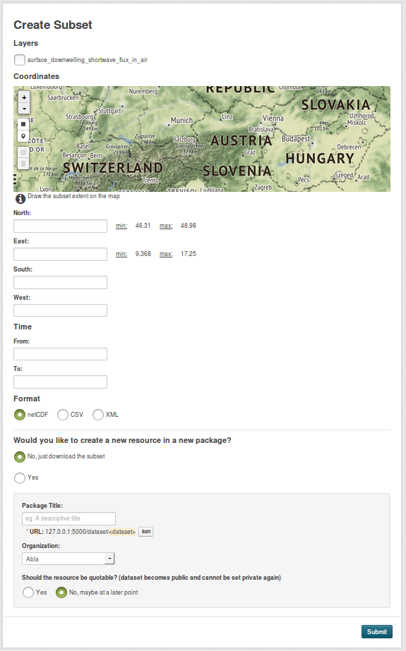
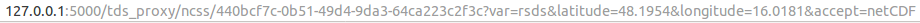
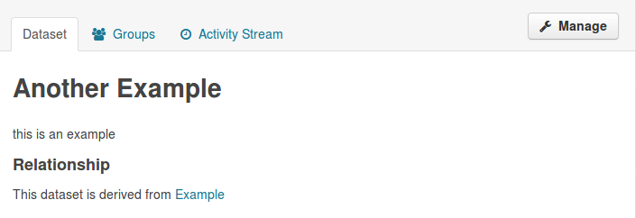
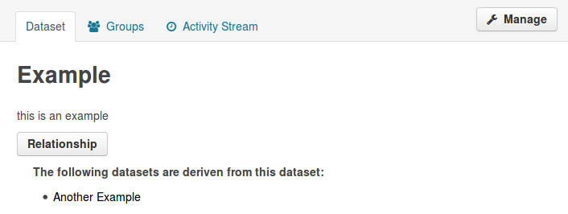

ckanext-thredds
=============

This extensions allows you to create subsets of NetCDF files.

A created NCSS query looks like this:

The created relationship exists between the resources as well as between the
datasets. The relationship between the datasets is displayed like this:

#### API function:

##### subset_create(context, data_dict)

Create a subset of a NetCDF resource.

You must be logged in in order to create and download a subset and the original
resource must be public.
If you want to create a new dataset with the subset, you must be authorized
to do so.

**Parameters:**
* **id** (string) - the id of the resource of which a subset is to be created
* **layers** (list of strings) - list of layer ids that should be included in the subset
* **format** (string) - format of the subset (NetCDF, XML or CSV)
* **type** (string) - (optional, default: download)
  * **download** - if subset should just be downloaded
  * **create_resource** - if subset should be created as resource in a new package
* **private** (bool) - the visibility of the package (optional, default: True)
* **organization** (string) - id or name of the organization, which is owner of
the dataset (required if type = create_resource)
* **package_name** (string) - name of the dataset to be created (required if type =
    create_resource)
* **package_title** (string) - title of the dataset to be created (required if type =
    create_resource)
* **resource_name** (string) - name of the resource (required if type =
    create_resource)
* **north** (float) - northern degree if bbox or latitude if point (optional)
* **east** (float) - eastern degree if bbox or longitude if point (optional)
* **south** (float) - southern degree if bbox (optional)
* **west** (float) - western degree if bbox (optional)
* **time_start** (iso date string) - start of time (optional)
* **time_end** (iso date string) - end of time (optional)

------------
Requirements
------------

For example, you might want to mention here which versions of CKAN this
extension works with.

------------
Installation
------------

.. Add any additional install steps to the list below.
   For example installing any non-Python dependencies or adding any required
   config settings.

To install ckanext-thredds:

1. Activate your CKAN virtual environment, for example::

     . /usr/lib/ckan/default/bin/activate

2. Install the ckanext-thredds Python package into your virtual environment::

     pip install ckanext-thredds

3. Add ``thredds`` to the ``ckan.plugins`` setting in your CKAN
   config file (by default the config file is located at
   ``/etc/ckan/default/production.ini``).

4. Restart CKAN. For example if you've deployed CKAN with Apache on Ubuntu::

     sudo service apache2 reload

---------------
Config Settings
---------------

Document any optional config settings here. For example::

    # The minimum number of hours to wait before re-checking a resource
    # (optional, default: 24).
    ckanext.thredds.some_setting = some_default_value

------------------------
Development Installation
------------------------

To install ckanext-thredds for development, activate your CKAN virtualenv and
do::

    git clone https://github.com/sureL89/ckanext-thredds.git
    cd ckanext-thredds
    python setup.py develop
    pip install -r dev-requirements.txt

-----------------
Running the Tests
-----------------

To run the tests, do::

    nosetests --nologcapture --with-pylons=test.ini

To run the tests and produce a coverage report, first make sure you have
coverage installed in your virtualenv (``pip install coverage``) then run::

    nosetests --nologcapture --with-pylons=test.ini --with-coverage --cover-package=ckanext.thredds --cover-inclusive --cover-erase --cover-tests

---------------------------------
Registering ckanext-thredds on PyPI
---------------------------------

ckanext-thredds should be availabe on PyPI as
https://pypi.python.org/pypi/ckanext-thredds. If that link doesn't work, then
you can register the project on PyPI for the first time by following these
steps:

1. Create a source distribution of the project::

     python setup.py sdist

2. Register the project::

     python setup.py register

3. Upload the source distribution to PyPI::

     python setup.py sdist upload

4. Tag the first release of the project on GitHub with the version number from
   the ``setup.py`` file. For example if the version number in ``setup.py`` is
   0.0.1 then do::

       git tag 0.0.1
       git push --tags

----------------------------------------
Releasing a New Version of ckanext-thredds
----------------------------------------

ckanext-thredds is availabe on PyPI as https://pypi.python.org/pypi/ckanext-thredds.
To publish a new version to PyPI follow these steps:

1. Update the version number in the ``setup.py`` file.
   See `PEP 440 <http://legacy.python.org/dev/peps/pep-0440/#public-version-identifiers>`_
   for how to choose version numbers.

2. Create a source distribution of the new version::

     python setup.py sdist

3. Upload the source distribution to PyPI::

     python setup.py sdist upload

4. Tag the new release of the project on GitHub with the version number from
   the ``setup.py`` file. For example if the version number in ``setup.py`` is
   0.0.2 then do::

       git tag 0.0.2
       git push --tags
